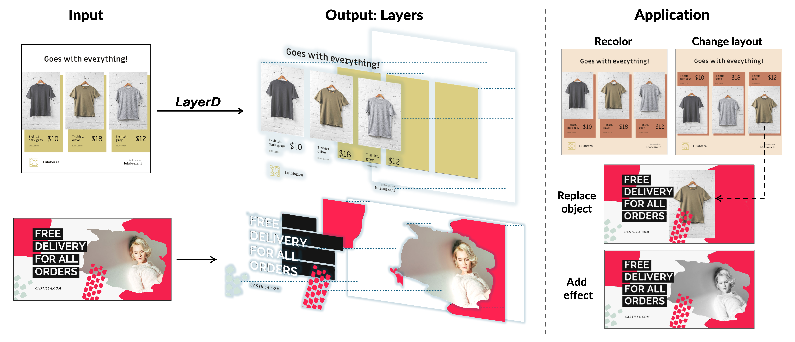

<div align="center">
<h1> LayerD: Decomposing Raster Graphic Designs into Layers </h1>

<h4 align="center">
    <a href="https://tomoyukun.github.io/biography/">Tomoyuki Suzuki</a><sup>1</sup>&emsp;
    <a href="">Kang-Jun Liu</a><sup>2</sup>&emsp;
    <a href="https://naoto0804.github.io/">Naoto Inoue</a><sup>1</sup>&emsp;
    <a href="https://sites.google.com/view/kyamagu">Kota Yamaguchi</a><sup>1</sup>&emsp;
    <br>
    <br>
    <sup>1</sup>CyberAgent, <sup>2</sup>Tohoku University
</h4>

<h2 align="center">
ICCV 2025
</h2>

</div>

<div align="center">

[](https://arxiv.org/abs/2509.25134)
<a href='https://cyberagentailab.github.io/LayerD/'></a>

</div>



LayerD is a layer decomposition method that extracts editable layers from raster graphic design images. This repository contains the official implementation of our ICCV 2025 paper.

See our [project page](https://cyberagentailab.github.io/LayerD/) for more details.

## Installation

Install LayerD with pip:

```bash
pip install git+https://github.com/CyberAgentAILab/LayerD.git
```

For other installation options (dataset generation, training, development), see the [Installation Guide](docs/installation.md).

## Quick Start

Decompose an image into layers:

```python
from PIL import Image
from layerd import LayerD

image = Image.open("./data/test_image_2.png")
layerd = LayerD(matting_hf_card="cyberagent/layerd-birefnet").to("cpu")
layers = layerd.decompose(image)
```

The output `layers` is a list of PIL Image objects in RGBA format.

## Documentation

- **[Installation Guide](docs/installation.md)** - Detailed setup instructions
- **[Inference Guide](docs/inference.md)** - Using LayerD for inference (CLI and Python API)
- **[Training Guide](docs/training.md)** - Training and fine-tuning models
- **[Evaluation Guide](docs/evaluation.md)** - Evaluating layer decomposition quality
- **[Architecture](docs/architecture.md)** - Code architecture and design patterns
- **[Development Guide](docs/development.md)** - Contributing and development workflows
- **[Troubleshooting](docs/troubleshooting.md)** - Common issues and solutions
- **[Contributing](CONTRIBUTING.md)** - How to contribute to LayerD

## License

This project is licensed under the Apache-2.0 License. See the [LICENSE](LICENSE) file for details.

LayerD uses several third-party libraries. See [docs/architecture.md](docs/architecture.md#bundled-dependencies) for details on bundled dependencies.

## Citation

If you find this project useful in your work, please cite our paper.

```bibtex
@inproceedings{suzuki2025layerd,
  title={LayerD: Decomposing Raster Graphic Designs into Layers},
  author={Suzuki, Tomoyuki and Liu, Kang-Jun and Inoue, Naoto and Yamaguchi, Kota},
  booktitle={ICCV},
  year={2025}
}
```
