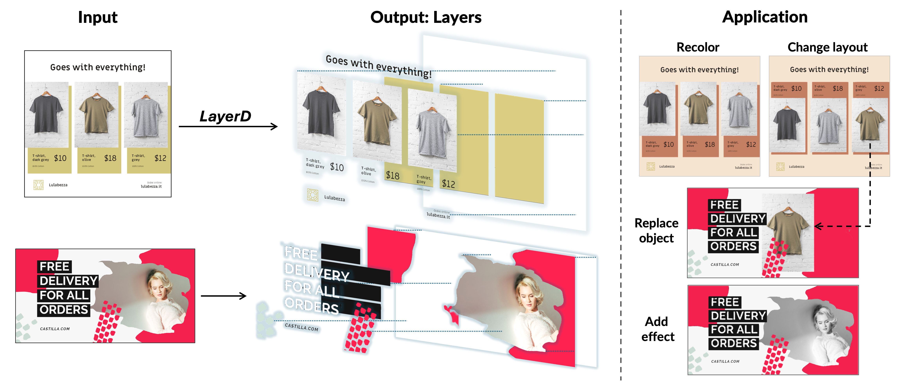

<div align="center">
<h1> LayerD: Decomposing Raster Graphic Designs into Layers </h1>

<h4 align="center">
    <a href="https://tomoyukun.github.io/biography/">Tomoyuki Suzuki</a><sup>1</sup>&emsp;
    <a href="">Kang-Jun Liu</a><sup>2</sup>&emsp;
    <a href="https://naoto0804.github.io/">Naoto Inoue</a><sup>1</sup>&emsp;
    <a href="https://sites.google.com/view/kyamagu">Kota Yamaguchi</a><sup>1</sup>&emsp;
    <br>
    <br>
    <sup>1</sup>CyberAgent, <sup>2</sup>Tohoku University
</h4>

<h2 align="center">
ICCV 2025
</h2>

</div>

<div align="center">

[](https://arxiv.org/abs/2509.25134)
<a href='https://cyberagentailab.github.io/LayerD/'></a>

</div>



This repository is the official implementation of the paper "LayerD: Decomposing Raster Graphic Designs into Layers".

## Setup

### Environment

We have verified reproducibility under the following environment.

- Ubuntu 22.04
- Python 3.12.3
- CUDA 12.8 (optional)
- [uv](https://docs.astral.sh/uv/) 0.8.17

### Install

LayerD uses [uv](https://docs.astral.sh/uv/) to manage the environment and dependencies.
You can install this project with the following command:

```bash
uv sync
```

## Quick example

You can decompose an image into layers using the following minimal example:

```python
from PIL import Image
from layerd import LayerD

image = Image.open("./data/test_image_1.png")
layerd = LayerD(matting_hf_card="cyberagent/layerd-birefnet").to("cpu")
layers = layerd.decompose(image)
```

The output `layers` is a list of PIL Image objects in RGBA format.
We provide some test images in the `data/` directory.

> [!NOTE]
> Building `LayerD` involves downloading two pre-trained models: the top-layer matting module from the Hugging Face repository [cyberagent/layerd-birefnet](https://huggingface.co/cyberagent/layerd-birefnet) (~1GB) and the inpainting model from [eneshahin/simple-lama-inpainting](https://github.com/enesmsahin/simple-lama-inpainting) (~200MB). Please ensure you have a stable internet connection during the first run.

## Inference

We provide a script to run inference on a dataset.

```bash
uv run python ./tools/infer.py \
  --input </path/to/input> \
  --output-dir </path/to/output> \
  --device <device>  # e.g., cuda or cpu
```

`--input` can be a file, a directory, or a glob pattern. You can also specify multiple input files like `--input img1.png img2.png ...`.
`--matting-weight-path` can be used to specify the path to the trained weights of the top-layer matting module. If not specified, it uses the model from [cyberagent/layerd-birefnet](https://huggingface.co/cyberagent/layerd-birefnet) by default.

## Training

We provide code for fine-tuning the top-layer matting part of LayerD on [Crello dataset](https://huggingface.co/datasets/cyberagent/crello).

### Dataset preparation

You can convert the Crello dataset for top-layer matting training.

```bash
uv run python ./tools/generate_crello_matting.py --output-dir </path/to/dataset> --inpainting --save-layers
```

> [!NOTE]
> This script downloads [the Crello dataset](https://huggingface.co/datasets/cyberagent/crello) (<20GB) from Hugging Face. Please ensure you have a stable internet connection and sufficient disk space for the first run.

This will create a dataset with the following structure:

```text
</path/to/save/dataset>
├── train
│   ├── im/ # Input images (full composite or intermediate composite images)
│   ├── gt/ # Ground-truth (top-layer alpha mattes)
│   ├── composite/ # Full composite images (not used for training, but for evaluation)
│   └── layers/ # Ground-truth layers (RGBA) (not used for training, but for evaluation)
├── validation
└── test
```

### Training

You can fine-tune the top-layer matting module on the generated dataset.

We reorganized the training code for this study, based on the original [BiRefNet](https://github.com/ZhengPeng7/BiRefNet/), which is the backbone of the top-layer matting module.
Training configuration is managed with [Hydra](https://hydra.cc/) as the training involves a lot of hyperparameters.

Below is an example command to start training with a specified configuration file.

```bash
uv run python ./tools/train.py \
  config_path=./src/layerd/configs/train.yaml \
  data_root=</path/to/dataset> \
  out_dir=</path/to/output> \
  device=<device>  # e.g., cuda or cpu
```

`data_root` is the dataset root path (like `</path/to/dataset>` above), `out_dir` is the output directory path, and they are mandatory fields in [the configuration file](./src/layerd/configs/train.yaml) that must be specified at runtime.
You also override other hyperparameters in the configuration file by specifying them in the command line arguments.

Training supports distributed mode using both [torch.distributed](https://pytorch.org/docs/stable/distributed.html) and [Hugging Face Accelerate](https://huggingface.co/docs/accelerate/index).

To use torch.distributed, launch the training script with `torchrun` as follows:

```bash
CUDA_VISIBLE_DEVICES=0,1 uv run torchrun --standalone --nproc_per_node 2 \
  ./tools/train.py \
  config_path=./src/layerd/configs/train.yaml \
  data_root=</path/to/dataset> \
  out_dir=</path/to/output> \
  dist=true
```

For Hugging Face Accelerate, set `use_accelerate=true` in the command line arguments.
You can also set the `mixed_precision` parameter (options: `no`, `fp16`, `bf16`).

```bash
CUDA_VISIBLE_DEVICES=0,1 uv run torchrun --standalone --nproc_per_node 2 \
  ./tools/train.py \
  config_path=./src/layerd/configs/train.yaml \
  data_root=</path/to/dataset> \
  out_dir=</path/to/output> \
  use_accelerate=true \
  mixed_precision=bf16
```

> [!NOTE]
> We observe that the training takes about 40 hours using A100 40GB x 4 GPUs with `use_accelerate=true`, `mixed_precision=bf16`, and [the default configuration](./src/layerd/configs/train.yaml).

We thank the authors of [BiRefNet](https://github.com/ZhengPeng7/BiRefNet) for releasing their code, which we used as a basis for our matting backbone.

## Evaluation

You can calculate the proposed evaluation metrics using the following minimal example:

```python
from layerd.evaluation import LayersEditDist

metric = LayersEditDist()
# Both layers_pred and layers_gt are lists of PIL.Image (RGBA)
result = metric(layers_pred, layers_target)
```

We also provide a script to run dataset-level evaluation.

```bash
uv run python ./tools/evaluate.py \
  --pred-dir </path/to/predictions> \
  --gt-dir </path/to/groundtruth> \
  --output-dir </path/to/output> \
  --max-edits 5
```

`--pred-dir` and `--gt-dir` need to follow the structure below.
The dataset prepared by the script in [Dataset preparation](#dataset-preparation) has a `layers/` directory (not `gt/`) that
follows this structure and is ready for evaluation (e.g., `--gt-dir </path/to/crello-matting>/layers`).

```text
</path/to/predictions or groundtruth>
├── {sample_id}
│   ├── 0000.png
│   ├── 0001.png
│   └── ...
└── {sample_id}
    ├── 0000.png
    ├── 0001.png
    └── ...
```

## License

This project is licensed under the Apache-2.0 License. See the [LICENSE](LICENSE) file for details.

### Third-party libraries

This project makes use of several third-party libraries, each of which has its own license:

- [BiRefNet](https://github.com/ZhengPeng7/BiRefNet) — [MIT License](https://github.com/ZhengPeng7/BiRefNet/blob/main/LICENSE)
- [simple-lama-inpainting](https://github.com/enesmsahin/simple-lama-inpainting) — [Apache-2.0 License](https://github.com/enesmsahin/simple-lama-inpainting/blob/main/LICENSE)

## Citation

If you find this project useful in your work, please cite our paper.

```bibtex
@inproceedings{suzuki2025layerd,
  title={LayerD: Decomposing Raster Graphic Designs into Layers},
  author={Suzuki, Tomoyuki and Liu, Kang-Jun and Inoue, Naoto and Yamaguchi, Kota},
  booktitle={ICCV},
  year={2025}
}
```
